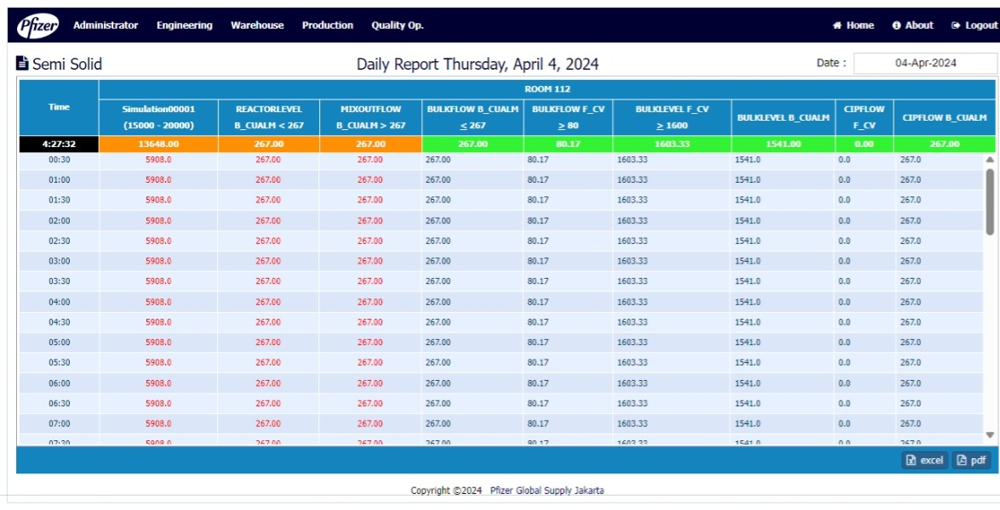
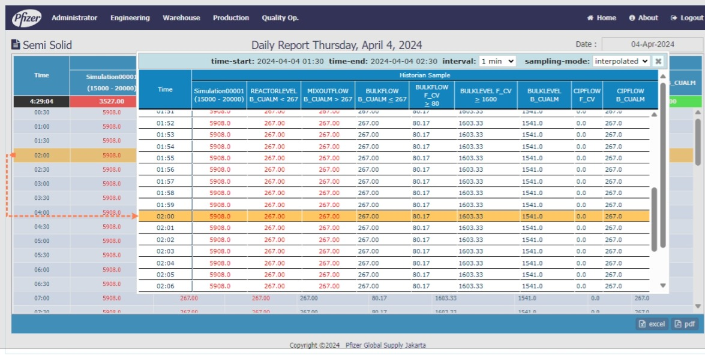
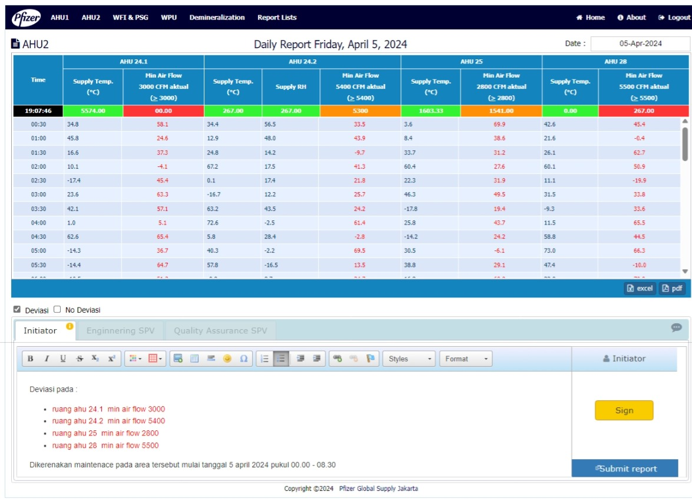
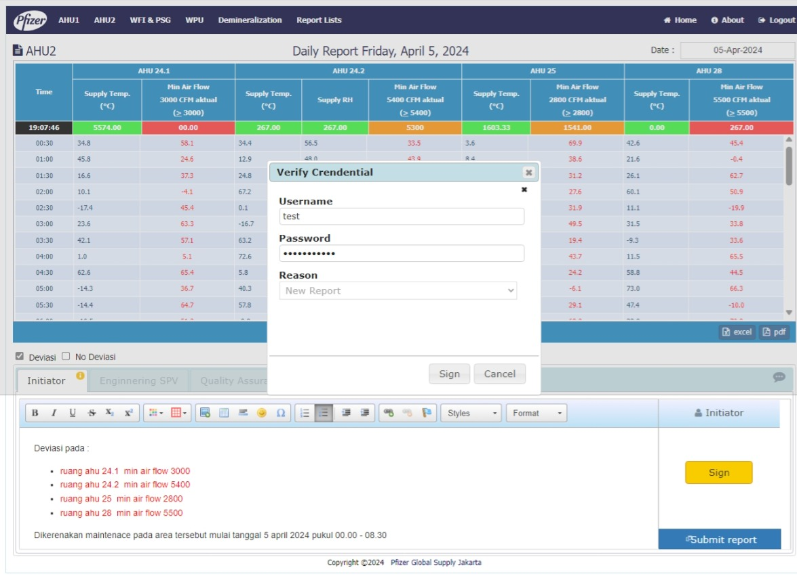

<p align="center">BMC (Building Management Controller)</p>
BMC is an application for monitoring and creating daily reports which include temperature, humidity, pressure, flow and various kinds of sensors connected to the SCADA system in real time.

</br><b>Screenshoot</b></br>








DIRECTORY STRUCTURE
-------------------
      assets/             contains assets definition
      commands/           contains console commands (controllers)
      config/             contains application configurations
      controllers/        contains Web controller classes
      mail/               contains view files for e-mails
      models/             contains model classes
      runtime/            contains files generated during runtime
      tests/              contains various tests for the basic application
      vendor/             contains dependent 3rd-party packages
      views/              contains view files for the Web application
      web/                contains the entry script and Web resources


REQUIREMENTS
------------
The minimum requirement by this project template that your Web server supports PHP 5.4.0.


INSTALLATION
------------

### Install via Composer
Update dependencies with Composer 
    ```
    composer update  
    ```

### Install with Docker

Update your vendor packages

    docker-compose run --rm php composer update --prefer-dist
    
Run the installation triggers (creating cookie validation code)

    docker-compose run --rm php composer install    
    
Start the container

    docker-compose up -d
    
You can then access the application through the following URL:

    http://127.0.0.1:8000

**NOTES:** 
- Minimum required Docker engine version `17.04` for development (see [Performance tuning for volume mounts](https://docs.docker.com/docker-for-mac/osxfs-caching/))
- The default configuration uses a host-volume in your home directory `.docker-composer` for composer caches


CONFIGURATION
-------------
### Database

Edit the file `config/db.php` with real data, for example:

```php
return [
    'class' => 'yii\db\Connection',
    'dsn' => 'mysql:host=localhost;dbname=bmc',
    'username' => 'root',
    'password' => '1234',
    'charset' => 'utf8',
];
```

Download [Selenium Server](http://www.seleniumhq.org/download/) and launch it:
    ```
    java -jar ~/selenium-server-standalone-x.xx.x.jar
    ```

    In case of using Selenium Server 3.0 with Firefox browser since v48 or Google Chrome since v53 you must download [GeckoDriver](https://github.com/mozilla/geckodriver/releases) or [ChromeDriver](https://sites.google.com/a/chromium.org/chromedriver/downloads) and launch Selenium with it:

    ```
    # for Firefox
    java -jar -Dwebdriver.gecko.driver=~/geckodriver ~/selenium-server-standalone-3.xx.x.jar
    
    # for Google Chrome
    java -jar -Dwebdriver.chrome.driver=~/chromedriver ~/selenium-server-standalone-3.xx.x.jar
    ``` 
    
    As an alternative way you can use already configured Docker container with older versions of Selenium and Firefox:
    ```
    docker run --net=host selenium/standalone-firefox:2.53.0
    ```

5. (Optional) Create `bmc` database and update it by applying migrations if you have them.
   ```
   tests/bin/yii migrate
   ```
   The database configuration can be found at `config/test_db.php`.

6. Start web server:
    ```
    tests/bin/yii serve
    ```

7. Now you can run all available tests
   ```
   # run all available tests
   vendor/bin/codecept run

   # run acceptance tests
   vendor/bin/codecept run acceptance

   # run only unit and functional tests
   vendor/bin/codecept run unit,functional
   ```

### Code coverage support
By default, code coverage is disabled in `codeception.yml` configuration file, you should uncomment needed rows to be able
to collect code coverage. You can run your tests and collect coverage with the following command:

```
#collect coverage for all tests
vendor/bin/codecept run -- --coverage-html --coverage-xml

#collect coverage only for unit tests
vendor/bin/codecept run unit -- --coverage-html --coverage-xml

#collect coverage for unit and functional tests
vendor/bin/codecept run functional,unit -- --coverage-html --coverage-xml
```

You can see code coverage output under the `tests/_output` directory.
